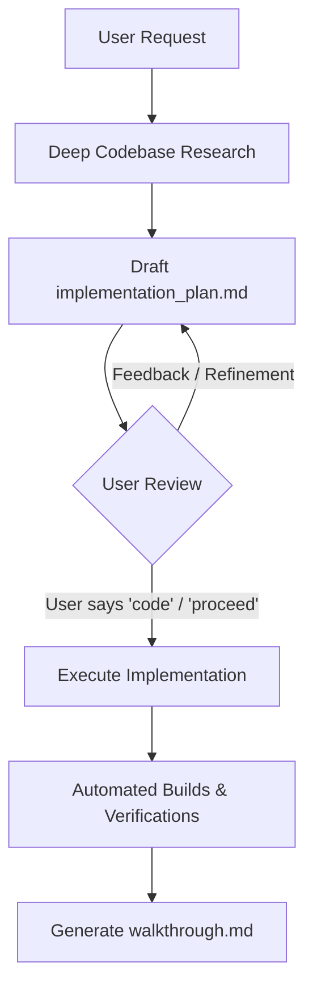

# Implementation Planning & Execution Workflow

This rule defines the mandatory lifecycle for proposing, reviewing, and executing technical changes in the repository.

---

## 🛑 The Non-Negotiable Gate: "Plan First, Code on Command"

1. **Never write code prematurely**: When a request involves multi-file changes, architectural design, schema updates, sensitive financial logic, RBAC, or performance-critical refactoring, do NOT start modifying code immediately.
2. **Multiple Iterations Welcome**: Expect the plan to go through 2, 3, or more review iterations. Align on requirements, corner cases, and trade-offs before touching a single source file.
3. **The "Code" Trigger**: Execution begins **ONLY** when the user explicitly responds with:
   - `"code"`
   - `"proceed"`
   - `"implement the plan"`
   - Or gives an unambiguous explicit approval to begin coding.

---

## 📋 Implementation Plan Structure

Every plan must be structured cleanly with the following sections:

### 1. Goal Description & Background
- Concise summary of the user requirement or reported problem.
- Technical background, current behavior, and why the current behavior is deficient.

### 2. User Review Required (High-Priority Decisions)
- Call out breaking changes, schema migrations, security boundaries, or UX shifts using GitHub alert syntax:
  > [!IMPORTANT]
  > Key decisions requiring user alignment (e.g., role attribution, permission hierarchies).
  > [!WARNING]
  > Potential breaking changes or backward-compatibility hazards.

### 3. Open Questions & Ambiguities
- Explicitly list edge cases or missing requirements.
- Never guess or make assumptions on business logic — surface the decision in the plan.

### 4. Proposed Changes (Grouped by Component)
- Breakdown by file with clear labels: `[MODIFY]`, `[NEW]`, or `[DELETE]`.
- Provide exact function names, types, and logic flow rather than vague hand-wavy descriptions.
- Order dependencies first (database models/types → services → API routes → frontend hooks → UI components).

### 5. Verification Plan
- **Automated Checks**: `npx tsc --noEmit` for backend; `npm run build` for frontend.
- **Integration/DB Tests**: Targeted scratch scripts or curl requests against live endpoints.
- **Manual User Verification**: Exact reproduction steps for the user to confirm in their browser or mobile device.

---

## 🔄 The Review Loop

1. **During Research**: Use read/search tools (`view_file`, `grep_search`, `list_dir`). DO NOT run modifying commands or touch project source code.
2. **During Review**: Address user feedback directly in the plan artifact, highlighting diffs and rationale.
3. **During Execution**: Make targeted, surgical edits preserving documentation, comments, and existing contracts.
4. **Post-Execution**: Verify immediately using build tools and document results in `walkthrough.md`.
