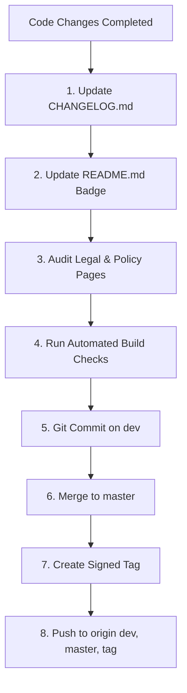

# Release Management, Versioning & Documentation Protocol

This rule defines the mandatory step-by-step procedure for versioning, documenting, testing, and publishing releases in the Bharat Enterprise platform.

---

## 📦 Versioning Rules (Semantic Versioning)

Releases follow `vMAJOR.MINOR.PATCH`:
- **MAJOR (`vX.0.0`)**: Paradigm shifts, foundational platform evolutions, breaking schema overhauls (e.g. `v2.0.0` dual-mode batch inventory and SaaS subscriptions).
- **MINOR (`v2.X.0`)**: New business domains, dashboards, or major capabilities (e.g. `v2.1.0` collections analytics, `v2.2.0` employee role dashboard).
- **PATCH (`v2.2.X`)**: Bug fixes, performance optimizations, UI refinements, and documentation synchronization (e.g. `v2.2.3` deduplication fix, `v2.2.4` velocity sorting fix).

---

## 📝 Pre-Release Checklist (Mandatory Order)

Before creating any git commit or tag, complete every step in this exact order:



### Step 1: Document in `CHANGELOG.md`
- Insert a new entry at the top under `## [vX.Y.Z](https://github.com/subhankar-das-phantom/Billing-Software/releases/tag/vX.Y.Z) — YYYY-MM-DD — Title`.
- Structure with:
  - **Summary**: Concise explanation of the problem solved or feature delivered.
  - **Component Breakdown**: Specific bullet points linking to files (`file.jsx`, `service.ts`) explaining the technical changes.
  - **Bug Fix / Architecture details**: Call out what changed and why.

### Step 2: Update `README.md`
- Update the version badge at line 3 of `README.md`:
  `[](...)`
- If the release introduces major operational capabilities or shifts feature gating across tiers, update the SaaS Subscription Matrix in `README.md`.

### Step 3: Audit Legal & Policy Pages
Whenever a release touches:
- **Authentication, user roles, or employee monitoring** → Review `frontend/src/pages/Legal/PrivacyPolicyPage.jsx`.
- **Payment gateways, subscription renewals, or refunds** → Review `frontend/src/pages/Legal/TermsPage.jsx`.
- Ensure disclosure statements match actual software behavior.

### Step 4: Run Automated Build Validations
Execute both verification commands and confirm zero errors:
1. **Backend TypeScript Check**:
   ```bash
   cd backend; npx tsc --noEmit
   ```
2. **Frontend Production Build**:
   ```bash
   cd frontend; npm run build
   ```
   Confirm build exits with code 0.

---

## 🚀 Git Flow & Signed Tagging Execution

Once files and builds are validated, run the standard git sequence.

### Granular, Purpose-Driven Commits on `dev`
Do **not** force unrelated changes into a single monolithic commit on `dev`. When a release spans multiple concerns (e.g. bug fixes, feature/component creations, documentation updates, or agent rules), split them into **multiple granular commits** structured by intent:
- `fix(<scope>): ...` for bug fixes, corrections, and issue resolutions.
- `feat(<scope>): ...` for new feature creation, new components, or newly introduced capabilities.
- `docs(<scope>): ...` for CHANGELOG, README, positioning guides, and documentation.
- `chore(<scope>): ...` or `style(<scope>): ...` for rule syncs, configuration, formatting, or agent definitions.

> [!IMPORTANT]
> **Mandatory Descriptive Merge Commits**: Every merge from `dev` into `master` must contain a comprehensive, multi-line commit message detailing the problem, root cause, architectural changes, rationale for any new components, modified files, and verification results. **Never use one-liners like `"sync dev to master"` or `"merge dev"`.**

```powershell
# 1. Stage and commit on dev — split into multiple commits if needed per purpose:
git checkout dev

# Example: Commit bug fixes
git add <fix-files>
git commit -m "fix(<scope>): <description of fixes>"

# Example: Commit newly created features / components
git add <new-component-files>
git commit -m "feat(<scope>): <description of new features>"

# Example: Commit documentation and changelog
git add CHANGELOG.md README.md <docs-files>
git commit -m "docs(release): bump version to vX.Y.Z and update documentation"

# Example: Commit agent rules or config
git add .agents/
git commit -m "chore(agents): update rules and guidelines"

# 2. Switch to master and merge dev with a rich descriptive message
git checkout master
git merge dev -m "<type>(<scope>): merge vX.Y.Z — <Release Title> into master`n`n### 🎯 Problem & Motivation`n- Concise explanation of the problem, bug, or business capability addressed.`n`n### 🔍 Root Cause Analysis`n- Technical explanation of why the issue occurred or why changes were needed.`n`n### 🛠️ Key Changes & Architectural Decisions`n- Detailed summary of fixes and enhancements.`n- If new components/files are introduced, explicitly document WHY they were added.`n`n### 📁 Key Files Modified`n- path/to/file1.jsx: Specific modifications`n- path/to/file2.ts: Specific modifications`n`n### ✅ Verification & Quality Assurance`n- Frontend build (npm run build): PASS (0 errors)`n- Backend verification: PASS`n- Document and visual verification summary"

# 3. Create cryptographically signed tag
git tag -s vX.Y.Z -m "Release vX.Y.Z - <Release Title>"

# 4. Return to working branch (dev)
git checkout dev

# 5. Push both branches and tag to origin
git push origin dev; git push origin master; git push origin vX.Y.Z
```

> [!CAUTION]
> Always verify that SSH or GPG signing is configured so `git tag -s` succeeds cleanly without prompt hangs.
